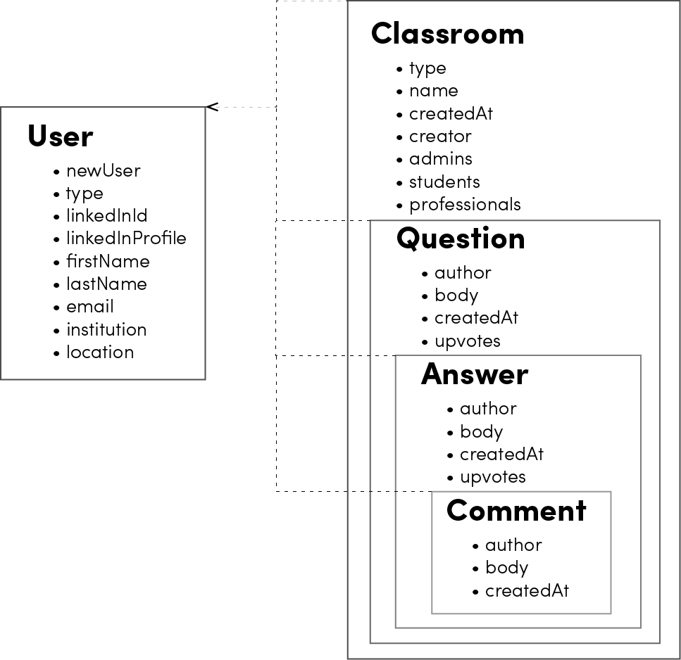
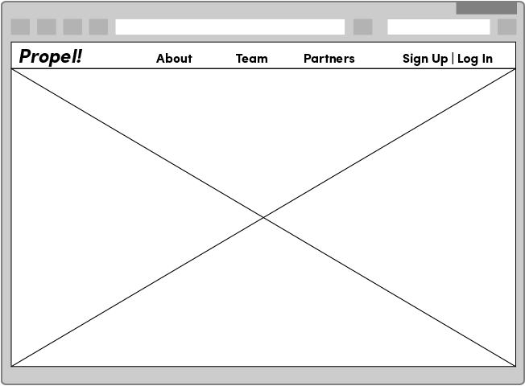
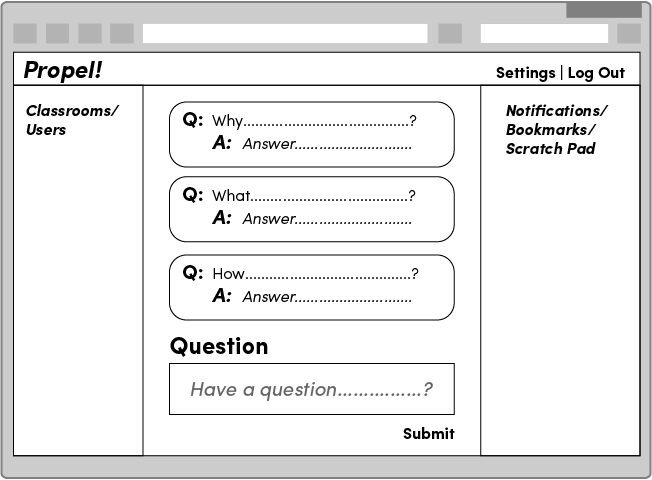
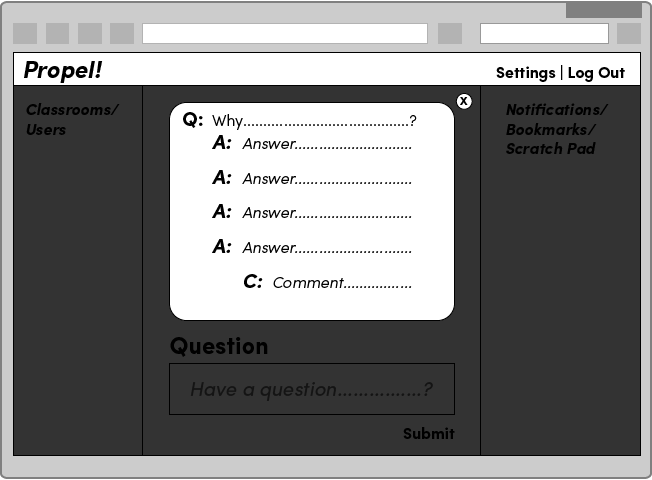

# Propel! Learning, boosted.

Propel! is a real-time Question and Answer app for classrooms. Speaking out in class is tough: the pace of a lesson might be too fast for pausing to ask questions, or a student simply might not feel comfortable.

Propel! changes that by ofering a forum for students to speak up, be heard, and have their questions answered, instantly. Instructors are better able to guage classroom learning in real-time by seeing exactly how many students are having trouble grasping specific concepts. Students are encouraged to gain reputation points by posting insightful answers, and instructors can tailor lessons precisely toward students’ needs. While there are sites such as Stack Overflow that have Q/A forums, it's often extremely difficult to sift through the answers that are relevant to a student's precise question or to contextualize the answers in a meaningful way.  

Propel! offers students the unique opportunity to receive answers from their peers, instructors, and industry professionals in real-time that are targeted for specific learning contexts. Propel!’s LinkedIn integration gives instructors the option to connect their professional networks with their classrooms, opening the class dialog to outside experts and helping students make industry connections.

## Who benefits and how?

* A student who initiates the question has instant access to answers and avoids the potential to either forget about their question or waste valuable time searching for an answer that may lead them to having even more questions.  Also, that student could start open dialogue with someone currently working in their chosen field, thus building their professional network.
* An instructor can answer the questions they may have normally missed. Also, if there's a subject matter that has a particularly high volume of the same type of questions, she/he can take the proper steps to rearrange the way they disseminate, or further elucidate that information.
* Students who answer questions, have the chance to reinforce what they've learned by explaining the principles incorporated into the subject matter. Their peers can also submit an upvote on answers that are deemed sound, and the more a student receives upvotes for the various questions answered, they'll be awarded higher status as a user with technical expertise.

## Ambitious? Yes.

Propel! is unique in its potential to grow organic professional and academic networks. A couple of features that will be implemented in the near future are:

* A working professional, via our LinkedIn API, gets a chance to stay sharp on basic skills and add an element of mentorship to the students. If that professional is a part of the talent acquisition element of his/her company, they can tap into a valuable resource of promising talent, as well.
* Multiple institutions will be able to join the discussions, offering a view into their course work, and providing a different perspective in the learning process.

## How To Use Propel! to Boost Your Classroom Experience
It's as easy as clicking the login button on the home page and granting LinkedIn authorization to release basic information about you and your network.  Propel! will ask a for a few extra bits of information to ensure you're able to participate in your proper class or subject matter.  You don't have to worry about creating a new password, our integration of the LinkedIn API takes care of that!

Once signed in, users are brought to the Propel! classroom, where they are prompted to add personal information. The Propel! dashboard offers instructors and course administrators the option to create a classroom, which generates a unique sign up code they can then share with students. A student can then join a classroom on via his/her dashboard view.

After creating and signing up for classrooms, users can enter any of their classrooms and start asking and answering questions. Users can also upvote excellent questions and answers to increase their visibility in the forum.

The effect is to generate a running FAQ of student questions that makes learning more efficient and fun!

Join Propel! for a fast-paced, thorough, and engaging learning experience that will most certainly add a boost to your future endeavors!

## General Approach for Propel!'s Development

[Check out Propel's Trello Board here.](https://trello.com/b/vsHXqFEq/wdi-project-3-propel)

[And our Pitch Deck here.]
(https://drive.google.com/file/d/0B-gPQrW54-ySSXk1NGZ2NGYybHM/view?usp=sharing)

Our team took advantage of the AGILE approach to development. AGILE encourages developers to envision project features in terms of the needs of site users. To this end, we generated numerous "user stories": what users would want to do or see on the site, and why.

> As a user, I want to receive answers to my questions from my fellow students, my instructors and professionals working in the industry.

We then made diagrams of our data model (ERD):

We then generated static visuals to begin realizing our user stories. These included wireframes, or diagrams, of site views. 

Concurrently, we developed a "pitch deck" that expressed our developing vision for Propel in terms of a business proposition to be pitched to investors.

Development then proceeded along two parallel paths: front-end web design beside back-end functionality. Once front-end views were templated, they were converted into embedded javascript files, a requirement for making our website a dynamic entity. At the same time, a great deal of applied logic went into creating seed data, routes, controller actions, and other computational structures.

Gradually these two halves came together to form a site we hope you enjoy.

## Technologies Utilized

A variety of languages, frameworks, libraries, and other technologies were used to create Propel. 

* HTML
* CSS
* Bootstrap
* Javascript
* jQuery
* socket.io
* AJAX
* MEN Stack:
  * MongoDB
  * Express
  * Node.js
* LinkedIn API
* LinkedIn OAuth
* Git
* Heroku (deployment)
* Lodash

## Propel! API Documentation
### RESTful Routes
Route   | Method       | Path                                                       | Authentication
---     | ---          | ---                                                        | ---
CREATE  | `POST`       |`/auth/linkedin/callback`                                   |LinkedIn OAuth token for a new User sign up
SHOW    | `GET`        |`/auth/linkedin/callback`                                   |LinkedIn OAuth token for a returning User login
DELETE  | `DESTROY`    |`/logout`                                                   |LinkedIn OAuth token for User logout
INDEX   | `GET`        |`/users`                                                    |Token required
SHOW    | `GET`        |`/users/:id`                                                |Token required
UPDATE  | `PUT/PATCH`  |`/users/:id`                                                |Token required
CREATE  | `POST`       |`/classrooms`                                               |Token required
INDEX   | `GET`        |`/classrooms`                                               |Token required
SHOW    | `GET`        |`/classrooms/:id`                                           |Token required
UPDATE  | `PUT/PATCH`  |`/classrooms/:id`                                           |Token required
DELETE  | `DESTROY`    |`/classrooms/:id`                                           |Token required
CREATE  | `POST`       |`/classrooms/:id/questions`                                 |Token required
INDEX   | `GET`        |`/classrooms/:id/questions`                                 |Token required
SHOW    | `GET`        |`/classrooms/:id/questions/:id`                             |Token required
UPDATE  | `PUT/PATCH`  |`/classrooms/:id/questions/:id`                             |Token required
DELETE  | `DESTROY`    |`/classrooms/:id/questions/:id`                             |Token required
CREATE  | `POST`       |`/classrooms/:id/questions/tags`                            |Token required
INDEX   | `GET`        |`/classrooms/:id/questions/tags`                            |Token required
SHOW    | `GET`        |`/classrooms/:id/questions/:id/tags/:id`                    |Token required
UPDATE  | `PUT/PATCH`  |`/classrooms/:id/questions/:id/tags/:id`                    |Token required
DELETE  | `DESTROY`    |`/classrooms/:id/questions/:id/tags/:id`                    |Token required
CREATE  | `POST`       |`/classrooms/:id/questions/answers`                         |Token required
INDEX   | `GET`        |`/classrooms/:id/questions/answers`                         |Token required
SHOW    | `GET`        |`/classrooms/:id/questions/:id/answers/:id`                 |Token required
UPDATE  | `PUT/PATCH`  |`/classrooms/:id/questions/:id/answers/:id`                 |Token required
DELETE  | `DESTROY`    |`/classrooms/:id/questions/:id/answers/:id`                 |Token required
CREATE  | `POST`       |`/classrooms/:id/questions/answers/comments`                |Token required
INDEX   | `GET`        |`/classrooms/:id/questions/answers/comments`                |Token required
SHOW    | `GET`        |`/classrooms/:id/questions/:id/answers/:id/comments/:id`    |Token required
UPDATE  | `PUT/PATCH`  |`/classrooms/:id/questions/:id/answers/:id/comments/:id`    |Token required
DELETE  | `DESTROY`    |`/classrooms/:id/questions/:id/answers/:id/comments/:id`    |Token required

## Future Development

Propel will be expanded in the future with the following features:

* Authentication through Google as an additional option to LinkedIn
* Instructors will be able to upload lesson outlines to enable students to interact with course content with greater levels of precision
* Although classrooms in Propel! are currently private, features will be added in the future to allow for public Q&A

## Team
Contributing to Propel! are:

* James Coslett
* Michael Durán
* Tony Estese
* Jerry Lee
* Keith To
